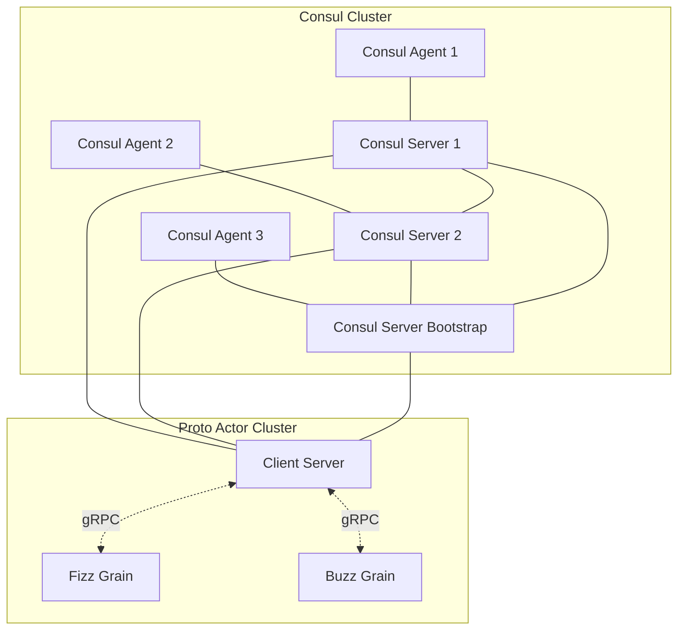

# Actor + OpenTelemetry + NewRelic

Proto Actorを使ったアクターシステムを監視するためのサンプルです。



```bash
$ export OTEL_EXPORTER_OTLP_ENDPOINT=your_endpoint
$ export NR_API_KEY=your_api_key
```

## run

下記のコマンドで起動します  
fizzアクター/buzzアクターはそれぞれ別のターミナルで起動してください  
クラスタになっており virtual actor / grainとして起動します

```bash
# run client
$ go run main.go
# run fizz buzz actor
$ go run fizz/main.go
$ go run buzz/main.go
```

クラスタの管理にはzookeeperを利用しています。  

## proto file generate

[proto](./shared) ディレクトリにあるprotoファイルをコンパイルする場合に利用します.  
サンプルには含まれているため不要ですが、protoファイルを変更した場合には以下のコマンドでコンパイルしてください。  

```bash
$ go install github.com/asynkron/protoactor-go/protobuf/protoc-gen-gograinv2@dev 
```

